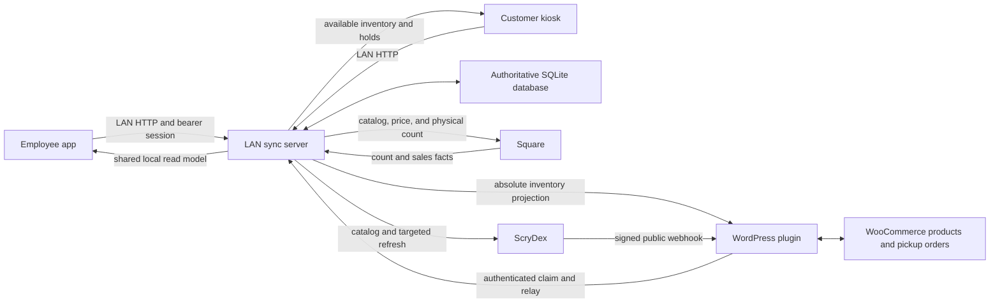

# Pug Architecture and Data Flow

## Status and scope

This document describes the `0.203.0` source architecture on the
`feature/end-to-end-production-repair` branch as reviewed on 2026-07-18. It
describes implemented behavior and automated verification in the repository.
It does not certify a production deployment, real store hardware, live provider
credentials, or external acceptance testing.

Evidence terms used below:

- **Implemented**: the behavior is present in source.
- **Automated verification**: repository tests or contract harnesses exercise
  the behavior with local or sanitized data.
- **External acceptance pending**: the behavior still requires an approved
  WordPress test-site, Square, ScryDex, network, Windows package, printer, or
  store-workflow exercise.

Secrets, PINs, application passwords, provider tokens, and webhook secrets must
remain in ignored environment files or host secret storage. They must never be
committed, logged, or returned to a client.

## Authority model

The LAN middleman server and its SQLite database are the transactional source of
truth for store inventory. WordPress/WooCommerce, Square, and the kiosk are
projections or consumers of that state, not competing inventory authorities.

| Domain | Authority | Projection or consumer |
| --- | --- | --- |
| Serialized inventory, quantity, availability, location, price, floor, and visibility | LAN SQLite | WordPress/WooCommerce, Square, employee app, kiosk |
| Inventory mutation history | Append-only LAN inventory ledger | Reports and incident review |
| Delivery state | LAN outbox event plus one delivery row per destination | WordPress and Square exact readback; kiosk local read model |
| Online order, payment, and pickup eligibility | WooCommerce | Pulled to LAN fulfillment after eligibility checks |
| Square payment and provider count facts | Square | Reconciled into LAN through controlled, idempotent sale/return handling |
| Kiosk cart holds | LAN reservations | Mirrored to WordPress when configured |
| Trade offers, approval, payout, and local credit | LAN SQLite | Accepted inventory is projected after conversion |
| Card reference catalog and provider observations | LAN reference cache populated from ScryDex | Used by intake and pricing, never treated as sellable stock |
| Public ScryDex webhook receipt | WordPress plugin | Signed events are claimed and relayed to LAN for targeted refresh |
| Price publication decision | LAN pricing engine and manager review | Approved price projects to WordPress and Square |
| Local store credit | LAN customer and credit ledger | Not a public WooCommerce coupon or Square gift card |

WordPress inventory import remains an explicit recovery/bootstrap action. The
normal background path does not silently grant WordPress authority over local
inventory.

## Runtime topology

The production LAN API defaults to TCP port `8787`. UDP port `8788` is used for
LAN discovery, with manual server URL entry as a fallback. Repository preview
launchers commonly serve the app UI on `127.0.0.1:1420`. Durable SQLite support
uses `node:sqlite`; use the Node version specified by the release package.

## Local persistence

Durable production startup opens the configured SQLite database, enables
foreign keys, applies the base schema upgrades, and applies authoritative schema
version 2 (`20260718_authoritative_inventory_sync_v2`). Production startup does
not seed demo inventory.

Important local tables include:

| Table | Purpose |
| --- | --- |
| `inventory_items` | Current serialized or quantity-bearing inventory state |
| `inventory_barcode_aliases` | Current and historical scanner identity; retired values cannot be reused by another item |
| `inventory_ledger_entries` | Idempotency-keyed before/delta/after audit, including on-hand, reserved, and available quantities |
| `inventory_reservations` | Durable active, released, expired, converted, or cancelled cart holds |
| `operation_queue` | Executable local work waiting for destination processing |
| `sync_outbox_events` | Durable event created with the authoritative mutation |
| `sync_outbox_deliveries` | Independent WordPress, Square, and kiosk delivery state, attempts, errors, response, and readback |
| `sync_outbox_replay_audit` | Manager, reason, request ID, prior state, and aggregate snapshot for a replay |
| `processed_external_events` | Idempotency for provider events and webhook refreshes |
| `price_observations` | Provider amount, source currency, FX attribution, normalized USD amount, and timestamps |
| `price_decisions` / `price_review_items` | Automatic decision or manager review lifecycle |
| `trade_in_orders` / `credit_ledger_entries` | Trade state, payout facts, and immutable local credit movement |
| `kiosk_orders` / `fulfillment_orders` | Active and historical pick workflows with per-item checks |
| `reference_cards` / `scrydex_catalog_sync_history` | Local card catalog, variants, price points, and sync history |

The authoritative v2 migration adds explicit reserved and available before/after
columns to existing ledger rows. It backfills old rows conservatively from their
recorded status. Because this changes audit interpretation, rollback should use
a verified pre-migration database rather than dropping audit columns after live
activity.

## Transactional mutation flow

Inventory intake, inventory edits, Square sale application, WooCommerce sale
allocation, accepted trade conversion, trade reversal, reservation expiry, and
approved price changes use the same boundary:

1. Authenticate and enforce staff or manager capability server-side.
2. Validate item identity, row state, absolute quantity, barcode, floor,
   reservation, and workflow preconditions.
3. Enter `BEGIN IMMEDIATE` in SQLite.
4. Update the local aggregate.
5. Append an idempotent inventory ledger entry.
6. Append the executable queue operation.
7. Append one outbox event and its destination delivery rows.
8. Commit once; on error, roll the complete mutation back.
9. Attempt only due, nonterminal destination deliveries.
10. Remove executable queue work only when required projections are complete.

The operation payload uses absolute quantity semantics. A request to set stock
to six means six on hand, not an increment of six. Ledger rows retain both the
delta and resulting total.

## Outbox delivery and readback

Each destination progresses independently through `pending`, `processing`,
`delivered_unverified`, `verified`, `retry`, `dead_letter`, or `cancelled`.
Claims have a lease; retry and delivered-but-unverified rows honor
`next_attempt_at_utc`. Exponential backoff is capped at one hour, and the
default maximum is 12 attempts.

- WordPress is complete only after the plugin returns the expected absolute
  state and WooCommerce projection verification.
- Square is complete only after catalog variation and location inventory
  readback match the expected SKU, price, currency, deletion state, location,
  and physical count.
- Kiosk delivery verifies against the same local authoritative read model.
- One verified destination does not hide a failure in another destination.

Managers can list sanitized delivery diagnostics through
`GET /sync/outbox/deliveries`. `POST /sync/outbox/replay` revalidates that the
current aggregate still exists, requires a stable request ID and reason, resets
only the selected destination, restores missing executable work when safe, and
writes `sync_outbox_replay_audit`. Verified and cancelled deliveries cannot be
replayed.

## WordPress and WooCommerce projection

The LAN connector creates or resolves the WordPress inventory identity, then
writes the full state through the versioned inventory projection route. The
WordPress schema target is version 17, which includes authoritative
`quantity_on_hand` and the durable ScryDex relay fields added in version 16.

The plugin applies quantity, normalized status, SKU/barcode, price, floor,
market attribution, visibility, and row version transactionally. It projects
the grouped inventory to WooCommerce, where cards with the same card/set
identity can expose condition-specific stock while preserving serialized local
identities. LAN readback rejects a partial or mismatched destination state.

WooCommerce paid local-pickup orders are external order facts, not inventory
authority. LAN allocates every exact line before applying any sale. If one line
cannot be allocated, no line is decremented. Applied orders retain an
`inventory_sale_applied_at_utc` marker and idempotent ledger references.

The plugin also relays explicitly requested paid terminal order history,
including credible refunded/cancelled records with exact serialized identities.
WordPress refund handling places exact sold copies into non-sellable
`return_review`; it never makes a returned card immediately available. The
corresponding LAN ingestion path must be included in final external acceptance
before production signoff.

## Square projection and reconciliation

For POS-visible inventory, the connector reuses a mapping or resolves the
variation by SKU, otherwise creates the Square catalog item and variation. It
updates catalog metadata and price, attaches an image when available, and sends
an absolute `PHYSICAL_COUNT` for the configured location. Square writes are
rate-limited by the connector and require exact readback.

Background Square polling can apply count decreases with
`apply_count_deltas: true`. A verified shortage is treated as a Square-origin
sale fact and is applied to local SQLite in one transaction with ledger and
outbox work. The resulting WordPress projection is queued immediately, while
the Square-origin change is not echoed back to Square.

Square overages are not imported as sellable inventory. An unambiguous one-copy
return for an exact sold serialized item is placed in `return_review`; ambiguous
or grouped overages remain actionable reconciliation exceptions. Manual Square
sale finalization also requires an exact scanned identity and receipt/order
reference and is idempotent.

The Square inventory connector does not replace Square payment authority. Card
capture remains with Square Terminal/POS or the configured WooCommerce Square
payment integration.

## Reservations and kiosk inventory

Kiosk and online cart coordination uses durable reservations. The default hold
is 15 minutes. Reservation creation checks available stock, and expiry releases
the hold through a ledgered state change. Kiosk search exposes only eligible,
available inventory and blocks zero or unapproved pricing.

The kiosk UI distinguishes approved live pricing, pending review, unavailable
inventory, and offline cached data. It reports last successful synchronization
instead of presenting stale data as live. Payment conversion and expiration are
idempotent, so replay does not sell the same serialized item twice.

## ScryDex and pricing

The LAN server owns the reference catalog and daily pricing job. It can run
full per-game pagination, targeted set/card imports, and webhook-triggered
expansion refreshes. The deterministic validation CLI checks represented sets
first, supports bounded provider-safe pagination, writes a stable CSV, and does
not mutate inventory.

WordPress is the public webhook receiver. It verifies the signed raw request,
stores safe event state, and exposes an authenticated relay inbox. LAN claims a
ready event, records provider-event idempotency, refreshes the affected catalog,
reprices eligible local inventory, and acknowledges processed or retry state.
The previously broken claim guard has been corrected in source and contract
coverage; a real public webhook-to-LAN acceptance run is still pending.

Pricing selects the exact provider card, variant, raw/graded type, condition, or
grading company and grade. Missing exact variant evidence creates manager review
instead of guessing. Raw condition and graded higher-grade fallback are recorded
as provenance. USD is direct; JPY conversion accepts only an attributed,
fresh-enough ECB/Frankfurter result. Missing or stale FX preserves the active
price.

The normal sale candidate applies configured markup, rounds according to the
central pricing rules, and never falls below the item floor. Large changes,
missing evidence, fallback cases, and configured exceptions create a manager
review. Approval, rejection, bulk decision, and reasoned manual override are
audited. An approved price is not considered published until WordPress and
Square projections verify.

## Trade-ins and local credit

Trade drafts and review records are not inventory. Each line stores quantity,
market basis, one 0-to-100 percent offer in 5 percent increments, final stored
value, and cash or local-credit payout. Acceptance is server-authoritative:

1. Validate customer and required ID fields.
2. Freeze each accepted final line value without applying the trade percentage
   a second time.
3. Apply local credit once when selected.
4. Create one deterministic pending-intake inventory row per accepted copy.
5. Write ledger, queue, outbox, staff identity, and order state atomically.

Repeated acceptance returns the existing result. Approved/converted/completed
records cannot be edited as drafts. Manager void reverses local credit once and
removes the created inventory through ledgered projections. Store credit remains
local and is not converted into a public coupon or Square gift card.

## Barcode identity

Current and historical barcodes resolve to the same inventory identity.
Database triggers prevent duplicate current barcodes and prevent a retired
barcode from being assigned to another item. Barcode migration performs
collision analysis before changing data, preserves quantities, and creates the
projection work needed to update destinations.

## Fulfillment and order history

The employee app separates active pickup work from searchable past orders. A
new eligible order increments the fulfillment badge and can trigger the local
employee notification sound. Staff claim/pick exact items, check every line,
mark the order ready, and complete pickup. Illegal status regressions and
completion before all items are checked are blocked. Replayed transitions are
idempotent.

Status changes are pushed to WordPress and retained in the local queue on
failure. Picking does not capture payment. Completed and expired kiosk orders
and completed website orders remain searchable without stacking in the active
queue.

## Reconciliation, backup, and recovery

`sync-reconciliation-report.mjs` compares local inventory with WordPress,
Square, kiosk visibility, reservations, queue state, and per-destination outbox
state. Report generation is read-only. `--reconcile-now` plans only local-to-
destination projection repairs; `--apply` additionally requires explicit local
authority confirmation and a reason. It does not import remote-only rows or
overwrite local inventory.

Manager maintenance supports SQLite checkpoint, `VACUUM INTO` backup, status,
website pull, targeted Square sync, checksum-validated patch staging, and
restart. Trade and barcode recovery CLIs default to dry-run, create an
additional SQLite backup before apply, replan inside `BEGIN IMMEDIATE`, abort on
blockers or changed source rows, and write JSON evidence.

Rollback guidance:

- Before code, schema, repair, or connector changes, checkpoint and create an
  off-host verified SQLite backup plus WordPress database/content backup.
- Prefer restoring the matching pre-change database and application package.
- Do not run destructive down migrations after live ledger/outbox activity.
- After restore, reconcile every WordPress order, Square sale/count change,
  kiosk hold, trade, and credit entry created after the backup before enabling
  projection writes.

## Verification boundary

Implemented paths have focused automated coverage for ledger atomicity,
reserved/available balances, exact projections and readback, due-time retry,
dead-letter replay audit, inventory quantity semantics, Square sale/return
reconciliation, WooCommerce sale allocation/refund quarantine, barcode history,
trade idempotency, kiosk expiry, fulfillment transitions, price review,
ScryDex pagination/validation/relay, migrations, and recovery-tool invariants.

The following remain external acceptance work and must not be represented as
completed merely because automated tests pass:

- Clean install and schema migration on the approved WordPress test site.
- Live WordPress/WooCommerce projection, order, refund, email, and readback.
- One reversible live Square item/count/sale workflow with cleanup evidence.
- Live ScryDex catalog validation and signed webhook relay through public
  WordPress scheduling to LAN acknowledgement.
- Multi-workstation discovery/manual fallback, offline recovery, and firewall
  behavior.
- Windows installers, service restart, DYMO/receipt printer, cash drawer, and
  Square Terminal hardware.
- Backup restore drill and post-restore external-event reconciliation.
- Final full-suite rerun, visual clickthrough, release packaging, and owner
  signoff for the exact release artifact.
