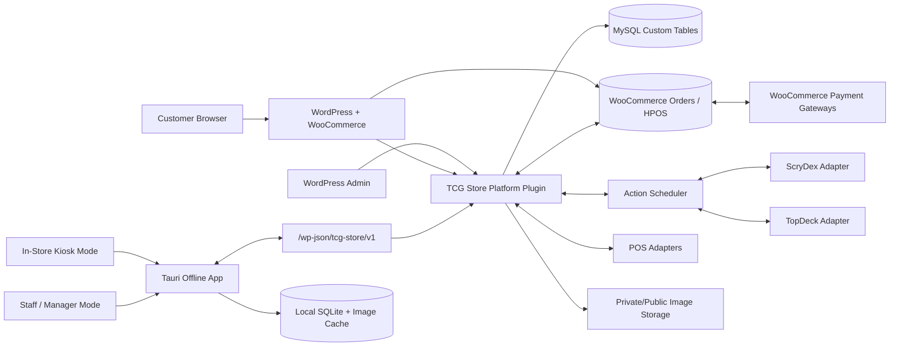

# Architecture

## Summary

The platform is a modular monorepo centered on a custom WordPress plugin named
**TCG Store Platform**. The plugin owns transactional business state in custom
MySQL tables. WooCommerce supplies storefront and checkout capabilities, but
serialized inventory availability is always validated against the plugin.

The Windows app uses Tauri, React, TypeScript, and SQLite unless a hardware
proof-of-concept demonstrates a blocker. It maintains a local searchable read
model and an idempotent operation queue so kiosk and staff workflows continue
during internet or WordPress outages.

Offline REST routes move through explicit readiness objects before live
registration. The staged pairing route now has a compact readiness planner that
composes the injected registration handler and configured pairing permission
callback into the existing bootstrap summary while preserving the
disabled-by-default route gate. Health and admin System Status expose that
pairing readiness as inspection metadata only; they do not register routes. A
plan-only pairing authorizer now sits behind the staged permission callback so
hashed pairing-code, manager, location, scope, and expiry policy can be tested
without issuing live device credentials.
The staged registration handler can also be assembled from the WordPress
database adapter, registration repository, registration service, and
settings-backed pairing authorizer when those dependencies are ready. That
factory reports handler readiness to health/admin diagnostics but does not
change route contracts or register live offline routes.
Registered-device permission resolver readiness now composes the WordPress
database adapter, registered-device repository, and session update repository
for pull/push route planning only. It can make permission callbacks ready in
the bootstrap summary while controller callbacks and route registration remain
disabled.
Registered-device sync route handler readiness now injects parser-only pull
and push handlers into the bootstrap controller boundary. Those handlers
validate request shape and report deferred writes, but they do not replay
queues, query pull data, advance cursors, or register routes.
The pull change-query planner adds safe domain contracts for future read
repositories, and sync handler readiness exposes those supported domains plus
trusted-context, query, cursor, and tombstone deferral flags without executing
database reads.
The pull change-query SQL builder now turns those contracts into prepared
per-domain SQL templates and argument arrays for staging review, while cursor
filtering, execution, tombstones, cursor advancement, and route registration
remain deferred.
The pull change repository adapter can now execute those prepared templates
only when explicitly called and normalize rows into pull change sets, while
route-connected execution, cursor advancement, tombstone reads, and route
registration remain deferred.
The pull change-set provider now composes request, explicit registered-device
context, query planning, and repository fetches behind an injectable boundary;
default route wiring still stays deferred.
The pull device context planner now validates authorized registered-device
permission resolutions into the exact device ID, offline device database ID,
and table prefix needed by that provider, while route handoff remains deferred.
The route-aware pull change-set provider can now be injected into the pull
handler to resolve registered-device headers and fetch provider change sets;
default route-connected reads, cursor advancement, tombstone reads, route
registration, and writes remain deferred.
The pull cursor advancement planner now validates complete provider change
sets into per-device cursor row payloads for future checkpoint upserts, while
cursor writes remain deferred.
The pull cursor SQL planner now converts those accepted cursor rows into
prepared upsert templates for staging review, while cursor execution remains
deferred.
The pull cursor repository now executes those upsert templates only when
explicitly called, leaving default route cursor execution deferred.
The route-aware pull cursor advancement provider can now be injected into
future orchestration to resolve registered-device headers, plan cursor rows
from returned change sets, and call that explicit repository while default
route execution remains deferred.
The pull handler now has a backward-compatible explicit cursor-advance
provider hook that can run after change sets are returned, fail closed on
cursor write rejection, and report cursor advancement metadata while default
handler execution remains deferred.
The pull route handler factory now composes the route-aware change-set and
cursor-advance providers only when explicitly enabled with WordPress database
dependencies, leaving default route dependency injection and route registration
deferred.

External services are isolated behind capability-reporting adapters. A method
can exist while returning `not_supported` until the capability is documented,
configured, and verified in the store's account.

## System Diagram



## Ownership Boundaries

| Domain | Authority | Replicas / integrations |
| --- | --- | --- |
| Serialized card inventory | Plugin custom tables | Woo product projection, Square projection, SQLite |
| Reservations | Plugin custom tables | Woo session metadata, SQLite pending reservations |
| Online orders/payments | WooCommerce CRUD/HPOS | Plugin sale conversion and audit |
| In-store payment | Configured POS/payment provider | Plugin POS reconciliation log |
| Customer store credit | Immutable plugin ledger | Cached balance and SQLite read model |
| Card reference/prices | Local normalized reference tables | ScryDex and future providers |
| Events | Plugin event tables unless hosted mode | TopDeck projection/import |
| Offline actions | Plugin after accepted sync | SQLite queue before acceptance |

## Transaction Boundaries

Critical inventory, reservation, sale, and credit writes run in explicit MySQL
transactions using row locks. All externally initiated writes require an
idempotency key. External API calls are never held inside a database
transaction; an outbox/background action performs them after local commit.

## Scheduling

The 9:00 AM daily job is scheduled as the next one-time occurrence in
`America/New_York`, then schedules the following occurrence after it starts.
This avoids daylight-saving drift caused by repeating every 86,400 seconds.
Action Scheduler performs the work in resumable pages. A real server cron should
invoke WordPress cron every five minutes because traffic-driven WP-Cron cannot
guarantee a 9:00 AM start.

## WordPress Plugin Structure

```text
apps/wordpress-plugin/
  tcg-store-platform.php
  uninstall.php
  composer.json
  src/
    Bootstrap/
    Admin/
    Api/V1/
    Auth/
    Audit/
    Buylist/
    Customers/
    Credit/
    Events/
    Inventory/
    Kiosk/
    Locations/
    Migrations/
    Payments/
    Pos/
    Pricing/
    Providers/
      Cards/
      Events/
      Payments/
      Pos/
      Search/
    Reservations/
    Search/
    Settings/
    Sync/
    WooCommerce/
  assets/
    admin/
    public/
  templates/
  languages/
  tests/
    Unit/
    Integration/
```

Each module contains application services, domain policies, repositories, REST
controllers, and module-specific hooks. WordPress and WooCommerce globals stay
at module boundaries so pricing, validation, and sync policies remain testable.

## Offline App Structure

```text
apps/offline-app/
  src/
    app/
    components/
    features/
      auth/
      buylist/
      credit/
      events/
      inventory/
      kiosk/
      labels/
      pick-queue/
      search/
      sync/
    modes/
      kiosk/
      staff/
      admin/
    services/
    state/
  src-tauri/
    src/
      commands/
      database/
      devices/
      printing/
      security/
      sync/
    migrations/
    capabilities/
  tests/
    unit/
    integration/
    e2e/
```

Hardware access is implemented behind Tauri commands and device adapters.
Keyboard-wedge scanners require no privileged driver. Printer integrations are
capability-tested per configured model before being marked supported.

The initial packaging scaffold targets a Tauri NSIS installer for
`x86_64-pc-windows-msvc`, producing a Windows `.exe` artifact. Production
distribution remains blocked until signing, hardware gates, and offline sync
integration tests pass.

The first local SQLite schema contract covers device identity, sync cursors,
the operation queue, sync logs, cached branding, cached inventory, cached
customer credit, cached events, and sync conflicts. These tables are a local
read model and queue only; WordPress remains authoritative after sync.
The WordPress plugin now defines planned offline route contracts for pairing,
pull, push, conflict listing, and conflict resolution. Pull/push contracts now
carry registered-device required scopes and planned permission strategy
metadata, but the routes stay disabled until device authentication, queue
replay, and conflict persistence pass staging integration tests. Push payload
validation is implemented separately so
the route handler can reject malformed operation batches before persistence or
conflict resolution is enabled. Pull request validation is also implemented so
devices can ask for known cached domains and cursors before live change queries
or cursor advancement are enabled. Pull response presentation is implemented so
repository-backed change sets can later be shaped into stable per-domain
cursors, change rows, tombstones, server timestamps, and `has_more` pagination
flags without changing the offline app contract. The staged pull route handler
now returns that response contract with empty domain change sets by default,
and any future change-set provider remains injected behind the same boundary
while live queries and cursor writes stay disabled. Pull change-query planning
now defines plan-only table, column, payload-field, cursor, and device-scoped
conflict contracts for those domains before any repository execution is wired.
Pull change-query SQL planning now compiles those contracts into safe prepared
`SELECT` templates for future repositories while keeping cursor filtering and
all database execution deferred.
Pull change repository adaptation now adds an explicit `$wpdb` execution
boundary and change-set row normalizer for those templates, while keeping route
connection, cursor advancement, tombstone reads, and route registration
deferred.
Pull change-set provider composition now gives staged tests a single explicit
provider to inject into the pull handler, without making that provider the
default route behavior.
Pull device context planning now creates the missing trusted-context handoff
contract from registered-device permission resolution to provider construction,
without wiring it into the default route path.
Device pairing request
validation is implemented so the future registration route can reject malformed
installation IDs, unsupported modes/scopes/capabilities, bad manager/location
IDs, unsupported platforms, and schema mismatches before any token or device row
is created. Device registration planning is also implemented so a validated
pairing request can be shaped into a future device row, one-time response,
sync route map, first-sync flags, token hash storage fields, and redacted audit
payload before live route persistence is enabled. Device registration
credential issuance now generates UUIDv4 device IDs, one-time device tokens,
SHA-256 token hashes, UTC issue/expiry timestamps, bounded TTL metadata, and
secret-free audit fingerprints for that future pairing flow. Device
registration insert query planning now maps those rows into prepared
`tcg_offline_devices` insert SQL with JSON/timestamp normalization and
secret-free audit metadata. Device registration repository adaptation now
executes that prepared insert only when explicitly called and returns inserted
or rejected outcomes, insert IDs, and the one-time pairing response while
keeping raw tokens and token hashes out of audits. Device registration service
orchestration now composes pairing validation, credential issuance,
registration planning, and explicit repository insertion into a route-ready
boundary with secret-free service audits. The same service can now optionally
require the staged pairing authorizer before credential issuance, so direct
staging service calls can fail before repository writes when pairing policy is
denied. An opt-in route handler adapter can
now dispatch that service through the offline controller's
`register_offline_device` callback for staged tests while default controller
behavior and route registration remain disabled. It now reports denied pairing
authorization as a distinct 403 response code before credential or repository
paths run. An opt-in pairing permission
callback adapter can now validate pairing request bodies and call an injected
manager/pairing authorizer, but the default permission factory still leaves
the pairing route locked. The first plan-only authorizer for that callback now
checks configured pairing-code hashes, manager/location allowlists,
mode-specific scopes, and UTC expiry windows while keeping audits free of raw
pairing secrets. Offline pairing authorization settings now define the
hash-only policy shape future staging code can pass into that authorizer
without saving raw pairing codes. A settings-backed pairing authorizer factory
now creates the staged authorizer or permission callback from that sanitized
policy while preserving default route lockout. Health and admin System Status
now report non-secret policy readiness so incomplete settings cannot be treated
as route-ready permissions. Device access policy checks are implemented so
future registered-device route permission callbacks can validate active state,
revocation, token expiry, required scopes, supported modes/scopes, location
IDs, and UTC timestamps before pull, push, or conflict work runs. Device
bearer-token authentication planning is implemented so future permission
callbacks can normalize request headers, validate token shape, compare SHA-256
token hashes, require persisted offline-device IDs, and return secret-free
accepted contexts before conflict or queue work starts.
Device token lookup planning now derives the hashed repository lookup filter
and short audit fingerprint before live row loading is enabled.
Device session planning now prepares a future last-seen update row, normalized
session context, row-version increment, and audit payload after the loaded row
matches an accepted access decision.
Registered-device permission planning now composes lookup-needed, denied, and
authorized outcomes for future REST permission callbacks without registering
routes, querying device rows, or mutating last-seen state.
Registered device row normalization now defines how future repository results
are coerced into auth/session-ready rows with decoded scopes/capabilities, UTC
timestamps, validation errors, and secret-free audits before those planners
consume them.
Registered device lookup-query planning now defines the future repository
query arguments, selected columns, active/revocation/expiry filters,
row-normalizer metadata, lock intent, and deferred scope checks before live SQL
execution is enabled.
Registered-device permission planning now carries that lookup-query plan in
lookup-required outcomes and rejects invalid query-planning inputs before live
repositories are called.
Registered-device lookup query building now validates the planned contract,
safe WordPress table prefixes, selected columns, and deferred scope behavior
before producing a prepared-SQL template and arguments for future repositories.
Registered-device repository adaptation now composes the query builder, `$wpdb`,
row normalizer, and repository result object so future permission callbacks can
load a planned device row as found, not found, or rejected without live route
wiring.
Registered-device permission resolution now composes initial token planning,
repository-backed lookup, loaded-row authorization, session update planning,
and redacted resolution audits into one route-ready boundary without writing
last-seen state or registering callbacks.
Offline device session update query building now converts the planned
last-seen update row into a prepared SQL template with an optimistic
row-version guard before any live write path is enabled.
Offline device session update repository adaptation now executes that prepared
query when explicitly called and reports applied, stale, or rejected outcomes
without registering REST permission callbacks.
Registered-device permission resolution now has an opt-in path that applies
that session update and denies stale or rejected update results before any
future route handler work can continue.
The planned registered-device permission callback adapter now maps
WordPress-style request headers into that resolver boundary and preserves the
last resolution for future audit logging without registering routes.
The planned offline route permission callback factory now maps registered-device
route contracts to `offline_pull` and `offline_push` callback adapters while
excluding pairing and manager conflict routes from device-token callback
construction.
Pairing permission callbacks can now be staged without constructing the
registered-device resolver; pull and push permission callbacks still require
that resolver before the factory returns them.
The pairing permission adapter also reports whether its authorizer is
configured, and the factory only returns configured pairing callbacks.
Registered-device permission resolver readiness now assembles that resolver
from `$wpdb`, the registered-device repository, and the session update
repository for staged pull/push permission callbacks, without opening live
routes or route-connected last-seen writes.
Registered-device sync route handler readiness now limits staged controller
handler injection to `pull_offline_changes` and `push_offline_operations`,
using parser-only handlers that keep write execution deferred.
The planned offline route registration planner now emits disabled registration
metadata with fail-closed callbacks, callback readiness, controller readiness,
and block reasons before any WordPress REST route can be registered.
Controller readiness now depends on explicitly injected route handlers, so the
planner does not treat default disabled controller methods as live-ready
callbacks.
The fail-closed offline controller scaffold now provides callback methods for
every planned offline route and returns disabled responses until the live route
handlers are implemented and staging-gated.
The guarded offline route registrar now calls route registration only for plans
marked ready and enabled; the current offline contracts produce zero registered
routes by default.
Offline REST request adaptation now gives the controller a route-ready request
data boundary for body params, query params, route params, headers, and
idempotency keys. Controller handler dispatch is explicit and injected, so the
default controller still returns disabled responses while future staging code
can test route handlers without changing route contracts.
Parser-only offline route validation handlers now sit behind that injected
dispatch point, validating pairing, pull, push, conflict list, and conflict
resolution payloads and returning safe summaries before any persistence or live
registration boundary is opened.
Offline route bootstrap planning now summarizes whether the offline feature
gate and planned route metadata allow registration, including route counts,
registerable route keys, per-route summaries, and block reasons, before any
future staging bootstrap calls the registrar.
That bootstrap state is now surfaced through authenticated health output and
admin System Status so staging can inspect readiness without opening the live
offline route boundary.
Health output includes an explicit `registration_deferred` signal for blocked
and gated plans.
The bootstrapper is now wired to WordPress `rest_api_init`, but it defers the
guarded registrar unless the offline feature gate and route-readiness plan both
allow registration.
Conflict list and resolution request validation is
implemented so future conflict-center routes can reject malformed filters,
unsupported actions, stale expected versions, missing manager context, and
unsafe adjustment payloads before live conflict reads or writes are enabled.
Conflict list response presentation is implemented so repository-backed rows
can later be shaped into stable conflict-center payloads without changing the
offline app contract.
Conflict resolution planning is implemented so future manager-reviewed actions
can produce deterministic row updates, response payloads, and redacted audit
payload hashes before live conflict writes are enabled. Offline push operation
resolution planning is implemented so future queue replay can produce
accepted/rejected outcomes, operation result rows, response payloads,
manager-reviewed conflict rows, deterministic conflict IDs, and redacted audit
payload hashes before live push persistence is enabled. Offline push batch
resolution planning now aggregates those per-operation plans into future route
responses, operation result rows, conflict rows, counts, and batch audit
payloads without enabling live database writes. WordPress-side offline sync
persistence schema now exists for registered devices, idempotent operation
queue/result rows, manager-reviewed conflicts, and per-device pull cursors.
Offline push persistence planning now maps resolved batches into deterministic
queue rows, conflict rows, idempotent replay rows, and redacted audit payloads
before live `$wpdb` writes are enabled.

## Storefront Product Strategy

Serialized singles use a WooCommerce catalog shell product for a card
family/version, while each cart line carries an exact `inventory_id`. Price and
availability are server-derived from the serialized item. Quantity is fixed to
one. The immutable order-line snapshot records inventory ID, barcode, condition,
grade, location, and charged price.

Regular quantity products such as supplies and sealed product may use native
WooCommerce stock. The two inventory models must not be conflated.

## Search Strategy

Launch uses custom MySQL `FULLTEXT` indexes plus structured indexes and a
version-grouping query. SQLite uses FTS5 where available, with a tested fallback
to indexed normalized columns. `SearchProvider` permits a later Meilisearch or
OpenSearch projection without changing API contracts.

## Multi-Location Strategy

Every inventory, reservation, sale, movement, credit transaction, event, device,
and audit record carries a location where relevant. Location IDs are stable
surrogate keys. No business rule assumes a single location, even though Phase 1
ships with one configured location.
