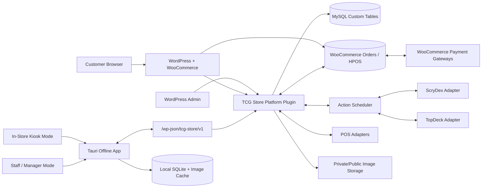

# Architecture

## Summary

The platform is a modular monorepo centered on a custom WordPress plugin named
**TCG Store Platform**. The plugin owns transactional business state in custom
MySQL tables. WooCommerce supplies storefront and checkout capabilities, but
serialized inventory availability is always validated against the plugin.

The Windows app uses Tauri, React, TypeScript, and SQLite unless a hardware
proof-of-concept demonstrates a blocker. It maintains a local searchable read
model and an idempotent operation queue so kiosk and staff workflows continue
during internet or WordPress outages.

External services are isolated behind capability-reporting adapters. A method
can exist while returning `not_supported` until the capability is documented,
configured, and verified in the store's account.

## System Diagram



## Ownership Boundaries

| Domain | Authority | Replicas / integrations |
| --- | --- | --- |
| Serialized card inventory | Plugin custom tables | Woo product projection, Square projection, SQLite |
| Reservations | Plugin custom tables | Woo session metadata, SQLite pending reservations |
| Online orders/payments | WooCommerce CRUD/HPOS | Plugin sale conversion and audit |
| In-store payment | Configured POS/payment provider | Plugin POS reconciliation log |
| Customer store credit | Immutable plugin ledger | Cached balance and SQLite read model |
| Card reference/prices | Local normalized reference tables | ScryDex and future providers |
| Events | Plugin event tables unless hosted mode | TopDeck projection/import |
| Offline actions | Plugin after accepted sync | SQLite queue before acceptance |

## Transaction Boundaries

Critical inventory, reservation, sale, and credit writes run in explicit MySQL
transactions using row locks. All externally initiated writes require an
idempotency key. External API calls are never held inside a database
transaction; an outbox/background action performs them after local commit.

## Scheduling

The 9:00 AM daily job is scheduled as the next one-time occurrence in
`America/New_York`, then schedules the following occurrence after it starts.
This avoids daylight-saving drift caused by repeating every 86,400 seconds.
Action Scheduler performs the work in resumable pages. A real server cron should
invoke WordPress cron every five minutes because traffic-driven WP-Cron cannot
guarantee a 9:00 AM start.

## WordPress Plugin Structure

```text
apps/wordpress-plugin/
  tcg-store-platform.php
  uninstall.php
  composer.json
  src/
    Bootstrap/
    Admin/
    Api/V1/
    Auth/
    Audit/
    Buylist/
    Customers/
    Credit/
    Events/
    Inventory/
    Kiosk/
    Locations/
    Migrations/
    Payments/
    Pos/
    Pricing/
    Providers/
      Cards/
      Events/
      Payments/
      Pos/
      Search/
    Reservations/
    Search/
    Settings/
    Sync/
    WooCommerce/
  assets/
    admin/
    public/
  templates/
  languages/
  tests/
    Unit/
    Integration/
```

Each module contains application services, domain policies, repositories, REST
controllers, and module-specific hooks. WordPress and WooCommerce globals stay
at module boundaries so pricing, validation, and sync policies remain testable.

## Offline App Structure

```text
apps/offline-app/
  src/
    app/
    components/
    features/
      auth/
      buylist/
      credit/
      events/
      inventory/
      kiosk/
      labels/
      pick-queue/
      search/
      sync/
    modes/
      kiosk/
      staff/
      admin/
    services/
    state/
  src-tauri/
    src/
      commands/
      database/
      devices/
      printing/
      security/
      sync/
    migrations/
    capabilities/
  tests/
    unit/
    integration/
    e2e/
```

Hardware access is implemented behind Tauri commands and device adapters.
Keyboard-wedge scanners require no privileged driver. Printer integrations are
capability-tested per configured model before being marked supported.

The initial packaging scaffold targets a Tauri NSIS installer for
`x86_64-pc-windows-msvc`, producing a Windows `.exe` artifact. Production
distribution remains blocked until signing, hardware gates, and offline sync
integration tests pass.

The first local SQLite schema contract covers device identity, sync cursors,
the operation queue, sync logs, cached branding, cached inventory, cached
customer credit, cached events, and sync conflicts. These tables are a local
read model and queue only; WordPress remains authoritative after sync.
The WordPress plugin now defines planned offline route contracts for pairing,
pull, push, conflict listing, and conflict resolution. Pull/push contracts now
carry registered-device required scopes and planned permission strategy
metadata, but the routes stay disabled until device authentication, queue
replay, and conflict persistence pass staging integration tests. Push payload
validation is implemented separately so
the route handler can reject malformed operation batches before persistence or
conflict resolution is enabled. Pull request validation is also implemented so
devices can ask for known cached domains and cursors before live change queries
or cursor advancement are enabled. Pull response presentation is implemented so
repository-backed change sets can later be shaped into stable per-domain
cursors, change rows, tombstones, server timestamps, and `has_more` pagination
flags without changing the offline app contract. Device pairing request
validation is implemented so the future registration route can reject malformed
installation IDs, unsupported modes/scopes/capabilities, bad manager/location
IDs, unsupported platforms, and schema mismatches before any token or device row
is created. Device registration planning is also implemented so a validated
pairing request can be shaped into a future device row, one-time response,
sync route map, first-sync flags, token hash storage fields, and redacted audit
payload before live token generation or persistence is enabled. Device access
policy checks are implemented so future registered-device route permission
callbacks can validate active state, revocation, token expiry, required scopes,
supported modes/scopes, location IDs, and UTC timestamps before pull, push, or
conflict work runs. Device bearer-token authentication planning is implemented
so future permission callbacks can normalize request headers, validate token
shape, compare SHA-256 token hashes, require persisted offline-device IDs, and
return secret-free accepted contexts before conflict or queue work starts.
Device token lookup planning now derives the hashed repository lookup filter
and short audit fingerprint before live row loading is enabled.
Device session planning now prepares a future last-seen update row, normalized
session context, row-version increment, and audit payload after the loaded row
matches an accepted access decision.
Registered-device permission planning now composes lookup-needed, denied, and
authorized outcomes for future REST permission callbacks without registering
routes, querying device rows, or mutating last-seen state.
Registered device row normalization now defines how future repository results
are coerced into auth/session-ready rows with decoded scopes/capabilities, UTC
timestamps, validation errors, and secret-free audits before those planners
consume them.
Registered device lookup-query planning now defines the future repository
query arguments, selected columns, active/revocation/expiry filters,
row-normalizer metadata, lock intent, and deferred scope checks before live SQL
execution is enabled.
Registered-device permission planning now carries that lookup-query plan in
lookup-required outcomes and rejects invalid query-planning inputs before live
repositories are called.
Registered-device lookup query building now validates the planned contract,
safe WordPress table prefixes, selected columns, and deferred scope behavior
before producing a prepared-SQL template and arguments for future repositories.
Registered-device repository adaptation now composes the query builder, `$wpdb`,
row normalizer, and repository result object so future permission callbacks can
load a planned device row as found, not found, or rejected without live route
wiring.
Registered-device permission resolution now composes initial token planning,
repository-backed lookup, loaded-row authorization, session update planning,
and redacted resolution audits into one route-ready boundary without writing
last-seen state or registering callbacks.
Offline device session update query building now converts the planned
last-seen update row into a prepared SQL template with an optimistic
row-version guard before any live write path is enabled.
Offline device session update repository adaptation now executes that prepared
query when explicitly called and reports applied, stale, or rejected outcomes
without registering REST permission callbacks.
Registered-device permission resolution now has an opt-in path that applies
that session update and denies stale or rejected update results before any
future route handler work can continue.
The planned registered-device permission callback adapter now maps
WordPress-style request headers into that resolver boundary and preserves the
last resolution for future audit logging without registering routes.
The planned offline route permission callback factory now maps registered-device
route contracts to `offline_pull` and `offline_push` callback adapters while
excluding pairing and manager conflict routes from device-token callback
construction.
The planned offline route registration planner now emits disabled registration
metadata with fail-closed callbacks, callback readiness, controller readiness,
and block reasons before any WordPress REST route can be registered.
The fail-closed offline controller scaffold now provides callback methods for
every planned offline route and returns disabled responses until the live route
handlers are implemented and staging-gated.
The guarded offline route registrar now calls route registration only for plans
marked ready and enabled; the current offline contracts produce zero registered
routes by default.
Conflict list and resolution request validation is
implemented so future conflict-center routes can reject malformed filters,
unsupported actions, stale expected versions, missing manager context, and
unsafe adjustment payloads before live conflict reads or writes are enabled.
Conflict list response presentation is implemented so repository-backed rows
can later be shaped into stable conflict-center payloads without changing the
offline app contract.
Conflict resolution planning is implemented so future manager-reviewed actions
can produce deterministic row updates, response payloads, and redacted audit
payload hashes before live conflict writes are enabled. Offline push operation
resolution planning is implemented so future queue replay can produce
accepted/rejected outcomes, operation result rows, response payloads,
manager-reviewed conflict rows, deterministic conflict IDs, and redacted audit
payload hashes before live push persistence is enabled. Offline push batch
resolution planning now aggregates those per-operation plans into future route
responses, operation result rows, conflict rows, counts, and batch audit
payloads without enabling live database writes. WordPress-side offline sync
persistence schema now exists for registered devices, idempotent operation
queue/result rows, manager-reviewed conflicts, and per-device pull cursors.
Offline push persistence planning now maps resolved batches into deterministic
queue rows, conflict rows, idempotent replay rows, and redacted audit payloads
before live `$wpdb` writes are enabled.

## Storefront Product Strategy

Serialized singles use a WooCommerce catalog shell product for a card
family/version, while each cart line carries an exact `inventory_id`. Price and
availability are server-derived from the serialized item. Quantity is fixed to
one. The immutable order-line snapshot records inventory ID, barcode, condition,
grade, location, and charged price.

Regular quantity products such as supplies and sealed product may use native
WooCommerce stock. The two inventory models must not be conflated.

## Search Strategy

Launch uses custom MySQL `FULLTEXT` indexes plus structured indexes and a
version-grouping query. SQLite uses FTS5 where available, with a tested fallback
to indexed normalized columns. `SearchProvider` permits a later Meilisearch or
OpenSearch projection without changing API contracts.

## Multi-Location Strategy

Every inventory, reservation, sale, movement, credit transaction, event, device,
and audit record carries a location where relevant. Location IDs are stable
surrogate keys. No business rule assumes a single location, even though Phase 1
ships with one configured location.
