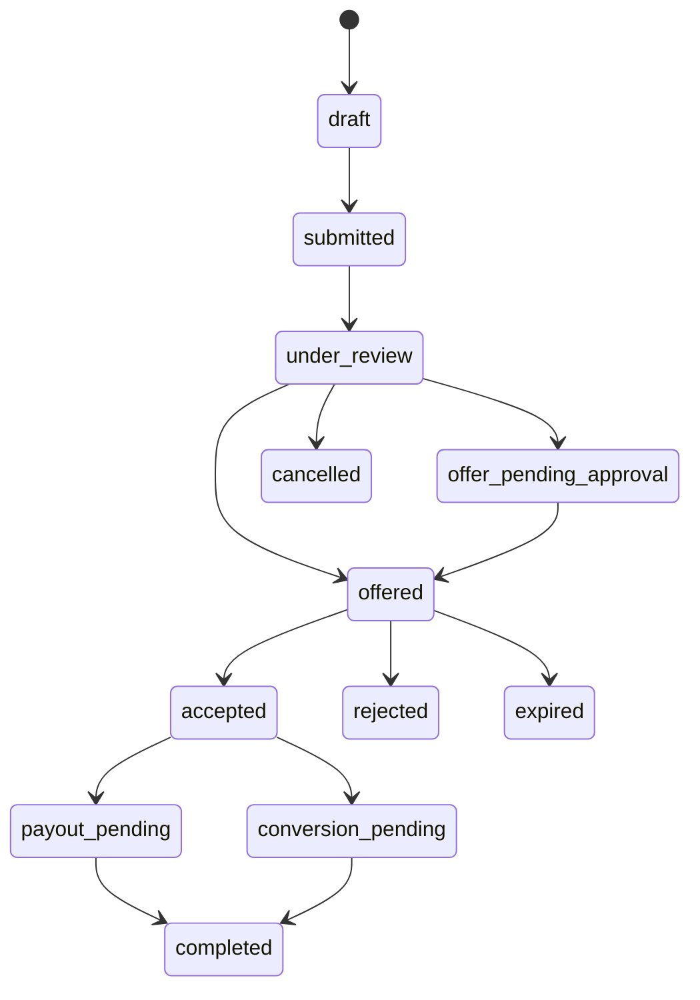

# Buylist

## Implementation Status

Schema migration `0005_buylist` is implemented for submissions, items, offers,
manager approvals, and conversion logs. The submission status helper is covered
by unit tests. Planned REST route contracts and submission intake payload
validation now cover public/staff intake, review, offer, acceptance, and
conversion surfaces before live route registration. Live buylist write APIs,
staff review UI, customer credit payout posting, and inventory conversion
workers remain disabled until staging acceptance.

## State Flow

## Customer Intake

Kiosk, website, staff, and offline app accept name, required phone, optional
email, and card entries. Vision is an identification aid only. Customers do not
set final condition, authenticity, grade, or offer.

Current intake payload validation requires a source, idempotency key, phone,
valid currency, and at least one card item. Each item must identify a card by
reference ID or manual card name, use a positive quantity, and provide grading
company plus grade when submitted as graded.

## Staff Review

Staff confirms:

- Exact card and variant.
- Quantity and ownership of physical items.
- Raw condition or grading company/grade/cert.
- Authenticity concerns.
- Current provider reference data and its timestamp/currency.

Offer rules are versioned configuration. Suggested cash and credit offers retain
the formula/configuration snapshot used.

## Approval

Manager approval is required for configured high item value, high total,
over-offer, authenticity concern, or condition mismatch. Approval is an
immutable decision record.

## Acceptance And Payout

Customer acceptance records selected cash or credit tender and offer version.
Credit payout posts through the customer ledger. Cash/payment payout stores no
card data and records only permitted transaction references.

## Inventory Conversion

Each accepted physical card creates one serialized `pending_intake` item.
Conversion carries the buylist cost and provenance, but the card cannot become
available until staff supplies:

- Exact reference or manual payload.
- Condition or grade.
- Sale price.
- Manually entered minimum sale price.
- Location.
- Unique barcode/SKU.

Conversion is idempotent and permanently linked to the buylist item.

## Offline

Offline submissions and staff notes can queue normally. Final high-value
approval, credit posting, and conflicting inventory conversion remain pending
until server acceptance unless a documented bounded offline policy permits them.
