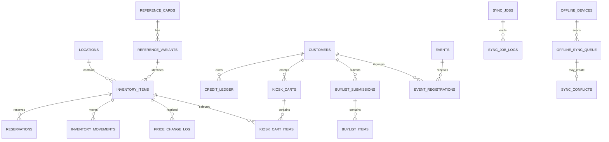

# Database

## Conventions

- Table names use the WordPress prefix: `{$wpdb->prefix}tcg_*`.
- Primary keys are `BIGINT UNSIGNED`.
- Public/offline identifiers are UUIDv7 strings in a separate `public_id`.
- Timestamps are `DATETIME(6)` in UTC. UI converts to the configured timezone.
- Money is `DECIMAL(19,4)` plus a three-character ISO currency.
- Provider payloads use `LONGTEXT` JSON with a payload hash and retention policy.
- Mutable aggregate rows include `row_version BIGINT UNSIGNED`.
- External/offline writes include a unique `idempotency_key`.
- Foreign keys are documented and used when the target hosting/database
  configuration is verified to support them reliably. Application-level
  integrity checks remain mandatory.
- Every schema change is a numbered, reversible migration where practical.
- Migration runner planning is unit-tested for clean install, prior-version
  upgrade, idempotent current-schema rerun, and rollback order. Live MySQL,
  `dbDelta`, backup/restore, and row-lock migration tests remain required in
  staging.
- Version `0.83.0` adds only staged offline route readiness planning. No
  WordPress schema, SQLite schema, migration order, or rollback target changes.
- Version `0.84.0` only surfaces staged pairing route readiness in health and
  admin status output. No WordPress schema, SQLite schema, migration order, or
  rollback target changes.
- Version `0.85.0` adds plan-only offline pairing authorization policy checks.
  No WordPress schema, SQLite schema, migration order, or rollback target
  changes.
- Version `0.86.0` adds optional registration service pairing authorization
  enforcement. No WordPress schema, SQLite schema, migration order, or rollback
  target changes.
- Version `0.87.0` adds staged registration route-handler response mapping for
  pairing authorization denials. No WordPress schema, SQLite schema, migration
  order, or rollback target changes.
- Version `0.88.0` adds hash-only offline pairing authorization settings inside
  the existing settings option. No WordPress schema, SQLite schema, migration
  order, or rollback target changes.
- Version `0.89.0` adds a settings-backed pairing authorizer factory. No
  WordPress schema, SQLite schema, migration order, or rollback target changes.
- Version `0.90.0` adds non-secret pairing policy readiness reporting. No
  WordPress schema, SQLite schema, migration order, or rollback target changes.
- Version `0.91.0` adds staged registration route-handler assembly and handler
  readiness reporting. No WordPress schema, SQLite schema, migration order, or
  rollback target changes.
- Version `0.92.0` adds registered-device permission resolver readiness and
  reporting. No WordPress schema, SQLite schema, migration order, or rollback
  target changes.
- Version `0.93.0` adds staged registered-device sync handler readiness and
  reporting. No WordPress schema, SQLite schema, migration order, or rollback
  target changes.
- Version `0.94.0` adds a staged offline pull response handler and reporting.
  No WordPress schema, SQLite schema, migration order, or rollback target
  changes.
- Version `0.95.0` adds plan-only offline pull change-query contracts. No
  WordPress schema, SQLite schema, migration order, or rollback target changes.
- Version `0.96.0` adds pull change-query readiness metadata in health/admin
  status. No WordPress schema, SQLite schema, migration order, or rollback
  target changes.
- Version `0.97.0` adds offline pull change-query SQL template planning. No
  WordPress schema, SQLite schema, migration order, or rollback target changes.
- Version `0.98.0` adds offline pull change repository adaptation. No
  WordPress schema, SQLite schema, migration order, or rollback target changes.
- Version `0.99.0` adds offline pull change-set provider composition. No
  WordPress schema, SQLite schema, migration order, or rollback target changes.
- Version `0.100.0` adds offline pull device context planning. No WordPress
  schema, SQLite schema, migration order, or rollback target changes.
- Version `0.101.0` adds route-aware offline pull provider handoff. No
  WordPress schema, SQLite schema, migration order, or rollback target changes.
- Version `0.102.0` adds offline pull cursor advancement planning against the
  existing `tcg_offline_pull_cursors` table. No WordPress schema, SQLite
  schema, migration order, or rollback target changes.
- Version `0.103.0` adds prepared SQL planning for the existing
  `tcg_offline_pull_cursors` table. No WordPress schema, SQLite schema,
  migration order, or rollback target changes.
- Version `0.104.0` adds explicit repository execution for prepared cursor
  upserts against the existing `tcg_offline_pull_cursors` table. No WordPress
  schema, SQLite schema, migration order, or rollback target changes.
- Version `0.105.0` adds route-aware pull cursor advancement provider
  composition over the existing cursor planner and repository. No WordPress
  schema, SQLite schema, migration order, or rollback target changes.
- Version `0.106.0` adds opt-in pull handler cursor advancement orchestration
  over existing cursor provider/repository contracts. No WordPress schema,
  SQLite schema, migration order, or rollback target changes.
- Version `0.107.0` adds pull route handler factory composition over existing
  registered-device, pull repository, and cursor repository contracts. No
  WordPress schema, SQLite schema, migration order, or rollback target changes.
- Version `0.108.0` adds offline push persistence SQL/repository staging over
  the existing `tcg_offline_sync_queue` and `tcg_sync_conflicts` tables. No
  WordPress schema, SQLite schema, migration order, or rollback target changes.
- Version `0.109.0` adds offline push route handler/factory composition over
  the existing registered-device, push resolution, and push persistence
  contracts. No WordPress schema, SQLite schema, migration order, or rollback
  target changes.
- Version `0.110.0` adds offline push server snapshot query planning over
  existing inventory, event, and customer credit tables. No WordPress schema,
  SQLite schema, migration order, or rollback target changes.
- Version `0.111.0` adds explicit offline push server snapshot repository
  adaptation over those existing tables. No WordPress schema, SQLite schema,
  migration order, or rollback target changes.
- Version `0.112.0` adds route-aware offline push snapshot provider
  composition over the existing snapshot repository. No WordPress schema,
  SQLite schema, migration order, or rollback target changes.
- Version `0.113.0` adds route-aware offline push operation-options provider
  composition over existing event payment status contracts. No WordPress schema,
  SQLite schema, migration order, or rollback target changes.
- Version `0.114.0` adds offline push existing operation-row query planning
  over the existing `tcg_offline_sync_queue` table. No WordPress schema,
  SQLite schema, migration order, or rollback target changes.
- Version `0.115.0` adds explicit existing operation-row repository adaptation
  over the existing `tcg_offline_sync_queue` table. No WordPress schema,
  SQLite schema, migration order, or rollback target changes.
- Version `0.116.0` adds route-aware existing operation-row provider
  composition over the existing queue table and staged repository. No WordPress
  schema, SQLite schema, migration order, or rollback target changes.
- Version `0.117.0` adds replay metadata to staged push planning, repository,
  and route response contracts. No WordPress schema, SQLite schema, migration
  order, or rollback target changes.
- Version `0.118.0` adds per-operation staged push response annotations for
  inserted/replayed persistence status. No WordPress schema, SQLite schema,
  migration order, or rollback target changes.
- Version `0.119.0` hydrates staged duplicate-push responses from existing
  queue rows already read for idempotency checks. No WordPress schema, SQLite
  schema, migration order, or rollback target changes.
- Version `0.120.0` adds plan-only canonical mutation descriptors for accepted
  offline push inventory, event, and credit operations. No WordPress schema,
  SQLite schema, migration order, or rollback target changes.
- Version `0.121.0` connects those descriptors to staged push route processing
  metadata and skips replayed operations before canonical write planning. No
  WordPress schema, SQLite schema, migration order, or rollback target changes.
- Version `0.122.0` adds staged canonical mutation SQL-template planning for
  those descriptors. No WordPress schema, SQLite schema, migration order,
  query execution, or rollback target changes.

## Relationship Overview



## Reference Data

### `tcg_reference_cards`

`reference_card_id`, `public_id`, `provider_name`, `provider_card_id`, `game`,
`name`, `normalized_name`, `supertype`, `set_id`, `set_name`, `set_code`,
`card_number`, `printed_number`, `year`, `rarity`, `rarity_code`, `language`,
`language_code`, `release_date`, `search_text`, `provider_updated_at`,
`created_at`, `updated_at`, `row_version`.

Unique: `(provider_name, provider_card_id)`.

Indexes: `(game, normalized_name)`, `(set_code, card_number)`,
`FULLTEXT(name, search_text)`, `updated_at`.

### `tcg_reference_sets`

`reference_set_id`, `public_id`, `provider_name`, `provider_set_id`, `game`,
`name`, `series`, `set_code`, `language`, `language_code`, `printed_total`,
`total`, `release_date`, `is_online_only`, `logo_url`, `symbol_url`,
`provider_updated_at`, `created_at`, `updated_at`.

Unique: `(provider_name, provider_set_id)`.

### `tcg_reference_variants`

`reference_variant_id`, `reference_card_id`, `provider_variant_id`, `variant`,
`finish`, `parallel`, `edition`, `language`, `raw_or_graded_support`,
`normalized_attributes_json`, `created_at`, `updated_at`.

Unique: `(reference_card_id, provider_variant_id)`.

### `tcg_reference_prices`

`reference_price_id`, `reference_variant_id`, `provider_name`, `price_type`,
`condition_code`, `grading_company`, `grade`, `is_perfect`, `is_signed`,
`is_error`, `low_price`, `mid_price`, `high_price`, `market_price`, `currency`,
`source_observed_at`, `created_at`, `updated_at`.

Unique across variant, provider, type, condition, grader, grade, flags, currency.

### `tcg_reference_price_history`

Same dimensional keys as current prices plus `price_date`, price metrics,
`provider_snapshot_id`, and `created_at`.

Unique across dimensions and `price_date`.

### `tcg_reference_images`

`reference_image_id`, `reference_card_id`, `reference_variant_id`, `side`,
`size_name`, `remote_url`, `local_relative_path`, `content_hash`, `mime_type`,
`width`, `height`, `download_status`, `last_verified_at`, timestamps.

### `tcg_reference_pop_reports`

`pop_report_id`, `reference_variant_id`, `provider_name`, `grading_company`,
`language_code`, `grade`, `count`, `total`, `observed_at`, timestamps.

### `tcg_reference_provider_raw_json`

`provider_snapshot_id`, `provider_name`, `resource_type`, `provider_resource_id`,
`request_fingerprint`, `payload_json`, `payload_hash`, `http_status`,
`sync_job_id`, `retention_expires_at`, `created_at`.

Payloads must be sanitized for credentials and customer personal data.

## Inventory

### `tcg_inventory_items`

Required business fields:

`inventory_id`, `public_id`, `reference_card_id`, `reference_variant_id`,
`manual_reference_payload_json`, `provider_name`, `provider_card_id`, `game`,
`card_name`, `set_name`, `set_code`, `card_number`, `printed_number`, `year`,
`rarity`, `rarity_code`, `variant`, `finish`, `parallel`, `language`,
`raw_or_graded`, `condition_code`, `grading_company`, `grade`, `cert_number`,
`barcode`, `sku`, `cost`, `cost_currency`, `market_price`,
`market_price_currency`, `suggested_price`, `sale_price`, `minimum_sale_price`,
`sale_currency`, `pricing_source`, `pricing_formula`, `price_lock`,
`price_floor_hit`, `location_id`, `case_id`, `box_id`, `binder_id`, `shelf_id`,
`row_slot`, `online_visibility`, `kiosk_visibility`, `pos_visibility`, `status`,
`front_image_local_path`, `back_image_local_path`, `front_image_remote_url`,
`back_image_remote_url`, `notes`, `staff_notes`, `date_acquired`, `date_listed`,
`date_sold`, `created_by`, `updated_by`, `created_at`, `updated_at`,
`row_version`.

Constraints:

- Unique `barcode`.
- Unique `sku`.
- `minimum_sale_price IS NOT NULL`.
- `sale_price >= 0` and `minimum_sale_price >= 0`.
- A listed item has a reference or manual reference payload.
- Raw items require condition; graded items require company and grade.
- Available/reserved items require location and barcode.

Indexes:

- `(status, location_id, online_visibility)`.
- `(game, card_name, set_code, card_number)`.
- `(reference_card_id, reference_variant_id, status)`.
- `(condition_code, grading_company, grade)`.
- `(updated_at, inventory_id)`.
- `FULLTEXT(card_name, set_name, notes)` where supported.

### Supporting Inventory Tables

| Table | Key fields and purpose |
| --- | --- |
| `tcg_inventory_locations` | `location_id`, parent, type, code, name, timezone, active; supports store/case/box/binder/shelf hierarchy |
| `tcg_inventory_movements` | item, from/to locations, reason, actor, device, idempotency key, timestamp |
| `tcg_barcodes` | barcode, entity type/id, symbology, print state, template, generated/printed timestamps |
| `tcg_reservations` | exact item, source, cart/order/customer, status, expiry, ownership token hash, unique active key |
| `tcg_price_change_log` | all old/new market/suggested/sale values, floor result, source, formula, actor/job, timestamp |
| `tcg_manager_overrides` | override type, item/customer, employee, manager, prices, reason, cart/order/location |
| `tcg_inventory_audit_log` | immutable before/after diff, action, actor, request/device IDs |

## Reservation Invariants

Status: schema migration `0007_reservations` and transaction-oriented
reserve/release/convert service helpers are implemented. WooCommerce checkout
hooks, kiosk cart write APIs, expiry workers, and database integration race
tests remain disabled until staging acceptance.

1. Lock the inventory row with `SELECT ... FOR UPDATE`.
2. Confirm status is `available` and visibility/source rules permit reservation.
3. Insert an active reservation and update inventory to `reserved` in the same
   transaction.
4. A nullable active claim column, `active_inventory_id`, equals `inventory_id`
   only for active reservations and has a unique index. This enforces at most
   one active reservation in MySQL without relying on a partial index.
5. Conversion to sale and release lock both rows and are idempotent. Expiry
   follows the same lifecycle pattern when cleanup workers are enabled.
6. A POS/offline conflict never overwrites `sold`; it creates a conflict record.

## Pricing Invariants

```text
suggested = round_currency(market * 1.10)

if sold: no change
if excluded status and not configured: no change
if price_lock: no change
if suggested < minimum_sale_price:
    new_sale_price = minimum_sale_price
    price_floor_hit = true
else:
    new_sale_price = suggested
```

- Minimum price is always staff-entered; no default is derived.
- Market and sale currencies must match unless a configured FX conversion has
  produced an explicit converted reference value.
- Every evaluated change writes a durable price-change record, including the
  reason for no change when audit detail is configured.
- Selling below minimum requires a live manager authorization and override row.

## Kiosk And Pick Queue

| Table | Key fields |
| --- | --- |
| `tcg_kiosk_carts` | public cart ID, customer, source device/location, status, expiry, totals snapshot, QR token |
| `tcg_kiosk_cart_items` | cart, inventory, reservation, price snapshot, status, substitution link |
| `tcg_pick_queue` | cart/order/event source, status, priority, assigned staff, timers |
| `tcg_pick_queue_items` | queue, inventory, location snapshot, found/missing/substituted status |

## Customers And Credit

Status: schema migration `0004_customer_credit` and idempotent ledger posting
internals are implemented. Write APIs, WooCommerce redemption hooks, offline
conflict handling, and staff UI remain disabled until staging acceptance.

| Table | Key fields |
| --- | --- |
| `tcg_customers` | names, normalized phone, display phone, normalized email, barcode, cached credit balance/version, status |
| `tcg_customer_contacts` | typed contact values, normalized/hash values, verification state |
| `tcg_customer_credit_ledger` | signed amount, before/after projection, type, actor/manager, reason, order/buylist/location/offline links |
| `tcg_customer_merge_log` | source/target customers, manager, field decisions, credit transfer entries |
| `tcg_customer_notes` | customer, visibility, author, note, timestamps |

Normalized phone is unique for active primary contacts. Duplicate candidates are
flagged rather than silently merged.

## Buylist

Status: schema migration `0005_buylist` is implemented. Write APIs, staff
review UI, credit payout posting, and inventory conversion workers remain
disabled until staging acceptance.

| Table | Key fields |
| --- | --- |
| `tcg_buylist_submissions` | customer, source, status, device/location, totals, timestamps |
| `tcg_buylist_items` | reference/manual identity, submitted/staff condition, grade, prices/offers, acceptance, converted inventory |
| `tcg_buylist_offers` | submission/item scope, cash/credit amounts, formula/config snapshot, expiry |
| `tcg_buylist_approvals` | threshold/reason, requester, manager, decision, timestamp |
| `tcg_buylist_conversion_log` | accepted item to pending inventory mapping and actor |

## Sync And Offline

Status: schema migration `0006_sync` is implemented for server sync jobs,
logs, checkpoints, errors, and provider webhook events. Schema migration
`0008_offline-sync` is implemented for registered offline devices, idempotent
operation queue/result rows, manager-reviewed sync conflicts, and per-device
pull cursors. Planned offline REST route contracts and offline push payload
validation exist for pairing, push, pull request validation, pull response
presentation, device pairing validation, device registration planning, device
access policy checks, conflict list filters, conflict resolution requests,
conflict list response presentation, and conflict resolution planning. Offline
push operation and batch resolution planning now prepares future queue result
rows, conflict rows, response counts, and audit payloads for accepted, rejected,
and manager-reviewed operation outcomes. Offline push persistence planning now
maps those plans into future queue/result rows, conflict insert rows, and
idempotent replay rows. Offline device registration credential issuance now
generates UUID device IDs, one-time tokens, SHA-256 token hashes, UTC
issue/expiry timestamps, TTL metadata, and secret-free fingerprints before the
existing planned `tcg_offline_devices` insert path is called. Offline
bearer-token authentication planning now
verifies future request headers and stored token hashes before queue/conflict
work proceeds. Offline token lookup planning now prepares the hashed
`token_hash` filter future repositories will use to load registered devices,
and offline session planning now prepares future `last_seen_at`, `updated_at`,
and `row_version` updates. Registered-device permission planning now composes
lookup, loaded-row authentication, and session update plans for future
permission callbacks without live queries or writes. Registered device row
normalization now validates and coerces raw `tcg_offline_devices` query results
into auth/session-ready rows without performing the live query. Registered
device lookup-query planning now defines the future `tcg_offline_devices`
selected columns, active/revocation/expiry filters, row-normalizer metadata,
lock intent, and deferred scope checks without executing SQL. Permission
planning now exposes that query contract in lookup-required outcomes before any
live repository call. Registered device lookup query building now validates
that contract and produces a prepared SQL template plus arguments without
executing the live repository query. Registered device repository adaptation
now executes the planned `tcg_offline_devices` read when called and normalizes
the returned row before future permission callbacks consume it. Registered
device permission resolution now can authorize that normalized row and prepare
the future last-seen update row without writing it. Offline device session
update query building now converts that row into an optimistic
`tcg_offline_devices` update template with `offline_device_id`, `public_id`,
and expected `row_version` guards. Offline device session update repository
adaptation can apply that prepared update when explicitly called and report
applied, stale, or rejected outcomes. Permission resolution can now opt in to
that update and fail closed on stale or rejected write results. Offline device
registration repository adaptation can now apply the planned
`tcg_offline_devices` insert when explicitly called and report inserted or
rejected outcomes with insert IDs and secret-free audits. Offline device
registration service orchestration can now call that repository after pairing
validation, credential issuance, and registration planning while keeping
service audits free of raw tokens and token hashes. A route handler adapter can
now invoke that service only when explicitly injected into the offline
controller, so route-connected registration writes remain disabled by default.
Route registration readiness also requires those explicit controller handler
injections; default disabled controller methods alone cannot register an
offline route and this revision adds no schema change.
Live provider
workers, route permission callback wiring, route-connected registration writes,
route-connected last-seen writes, and offline route writes remain disabled
until later phases. The pairing permission callback adapter does not add
tables; it validates request bodies and delegates authorization to an injected
callback before any future route registration can proceed. The planned
permission callback factory can now expose pairing callbacks without a
registered-device resolver and still returns no pull/push permission callbacks
until that resolver is present. Pairing callback readiness now requires an
injected authorizer and adds no schema change. The planned permission callback
adapter does not add tables; it only composes request headers into the resolver
boundary.

| Table | Key fields |
| --- | --- |
| `tcg_sync_jobs` | type/provider/status, endpoint/game/set/page/cursor checkpoints, counters, heartbeat, cancellation |
| `tcg_sync_job_logs` | sequence, level, code, message, masked context JSON |
| `tcg_sync_checkpoints` | job/resource partition, page/cursor, high-water mark, payload hash |
| `tcg_sync_errors` | classification, retryability, request fingerprint, masked payload, resolution |
| `tcg_webhook_events` | provider event ID unique, signature status, payload hash/body, processing state |
| `tcg_offline_devices` | device public ID, location, mode, token hash, scopes/capabilities, status, revoked/last-seen timestamps |
| `tcg_offline_sync_queue` | device, client operation UUID unique, sequence, operation type, entity/version, payload, acceptance state/result |
| `tcg_sync_conflicts` | entity, server/client versions and payloads, conflict type, severity, resolution and manager |
| `tcg_offline_pull_cursors` | device/domain cursor, last server time, last pull timestamp, row count |

## POS And Payments

| Table | Key fields |
| --- | --- |
| `tcg_pos_sync_log` | provider/location, external transaction/order/item, barcode/inventory mapping, result, idempotency |
| `tcg_payment_provider_log` | provider, Woo order, external transaction, operation, amount/currency, status, masked response |
| `tcg_payment_fee_snapshots` | provider, channel, percentage/fixed/other configured fees, effective dates, source note |

## Events

| Table | Key fields |
| --- | --- |
| `tcg_events` | all requested event fields, local state, TopDeck linkage/capabilities, Woo product, row version |
| `tcg_event_registrations` | event/customer/order, status, payment state, TopDeck state, email privacy fields, idempotency |
| `tcg_event_registration_logs` | immutable transition and provider response summary |
| `tcg_event_waitlist` | event/registration, position, joined/promoted timestamps |
| `tcg_event_checkins` | event/registration, actor/device/location, timestamp |
| `tcg_event_templates` | reusable local event defaults |
| `tcg_event_topdeck_sync_log` | endpoint/TID, operation, request fingerprint, response/status, timestamps |

Event capacity is guarded with an event-row lock. Payment success and external
registration success are separate states.

## Settings And Security

| Table | Key fields |
| --- | --- |
| `tcg_settings` | namespaced key, typed value/encrypted reference, location scope, feature flag, version |
| `tcg_api_keys` | provider/key label, encrypted secret or external-config reference, key fingerprint, rotation metadata |
| `tcg_role_permissions` | role/capability, location scope, allow/deny |
| `tcg_audit_log` | immutable action, entity, actor/manager/device, request ID, before/after hash/diff, IP metadata |

## Offline App SQLite

The Windows offline app uses local SQLite as a read model and operation queue.
WordPress remains authoritative after sync acceptance; the app never connects
directly to MySQL.

Version `0.35.0` adds the first local migration contract:

- `app_metadata`
- `device_identity`
- `sync_cursors`
- `operation_queue`
- `sync_log`
- `cached_branding`
- `cached_inventory`
- `cached_customer_credit`
- `cached_events`
- `sync_conflicts`

No SQLite migrations are executed by the WordPress plugin.

## Retention

- Credit, manager override, inventory movement, sale, and sensitive audit records
  are retained indefinitely unless legal counsel sets a different policy.
- Provider raw payloads and verbose request logs use configurable retention.
- Personal data exports/deletion must preserve legally required financial audit
  records while pseudonymizing non-required profile fields.
