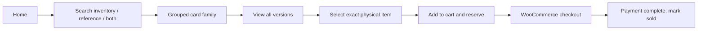

# UI Flows

## Shared Design

The visual system is a premium collector-vault theme with high contrast,
responsive layouts, game accent chips, clear availability/status, and reusable
card/slab tiles. Shared tokens and TypeScript component contracts live in
`apps/shared-ui`; WordPress rendering may use equivalent PHP/block wrappers.
Company name, logo, support URL, receipt footer, staging banner color, and
interface color tokens come from branding settings so the same UI can be
deployed for multiple companies without source changes.

Required components:

`UniversalSearchBar`, `GameChip`, `SetFilter`, `CardTile`,
`CardVersionGroup`, `InventoryItemRow`, `PriceBadge`, `StatusBadge`,
`ReservationTimer`, `CustomerLookup`, `CreditBalanceBadge`, `KioskButton`,
`KioskCartPanel`, `EventCard`, `EventCalendar`, `EventStatusBadge`,
`SyncProgressPanel`, `LiveLogViewer`, `PickQueueCard`, and
`ManagerOverrideModal`.

## Customer Website

The exact-item list shows condition/grade, variant, price, pickup location
availability, image, and reservation state. Quantity for serialized items is one.

## Kiosk

Landing actions:

- Find Cards
- Sell Cards to Store
- Check Store Credit
- Pickup Existing Cart
- Events
- Ask Staff

Card flow:

1. Capture first/last name and required phone; email optional.
2. Search by text, game, filters, or scanner.
3. Show families, then versions, then exact items.
4. Reserve exact item online or mark local reservation pending sync.
5. Submit cart to counter.
6. Display cart ID, QR, first name, phone last four, and status.
7. Clear personal data after inactivity.

Kiosk never displays payment UI or wp-admin. Touch targets are at least the
agreed accessibility size and all actions are keyboard accessible.

## Staff Intake

1. Scan barcode/photo or search manually.
2. Use ScryDex Vision/search when available; local reference search offline.
3. Confirm exact version.
4. Select raw condition or graded details.
5. Review dimensional market data and provider timestamp.
6. Default sale price to configured `market + 10%`.
7. Enter required minimum price manually.
8. Assign location and visibility.
9. Generate unique barcode/SKU.
10. Save and print label.

Bulk intake stages identification first, then bulk review, approval, and label
generation. Each physical card remains a separate item.

## Pick Queue

Staff sees source, customer/phone ending, age, item count, total, assignment,
status, and pick locations. Item actions are found, missing/conflict, substitute,
and release. Substitution creates a new exact reservation and may require
manager approval.

## Manager

Manager screens prioritize:

- Below-minimum price approval.
- Credit adjustment/void.
- High-value buylist approval.
- Duplicate customer merge.
- Offline/POS conflict resolution.
- Sync failure and settings review.

Manager reauthentication and reason are required at the decision point.

## Events

Public list/calendar leads to event detail and one of:

- Redirect/link to TopDeck-hosted registration.
- Local registration with optional Woo payment, then TopDeck push.
- Local-only reservation.

Staff event flow covers attendee sync, pending pushes, payment exceptions,
waitlist, QR check-in, walk-ins, refunds, and exports.

## Accessibility

- Keyboard navigation and visible focus.
- Semantic headings, labels, status announcements, and error summaries.
- High contrast and non-color status cues.
- Alt text for card/event images where meaningful.
- Timeout warning with extend-session action.
- No sensitive customer data announced or left visible after reset.
